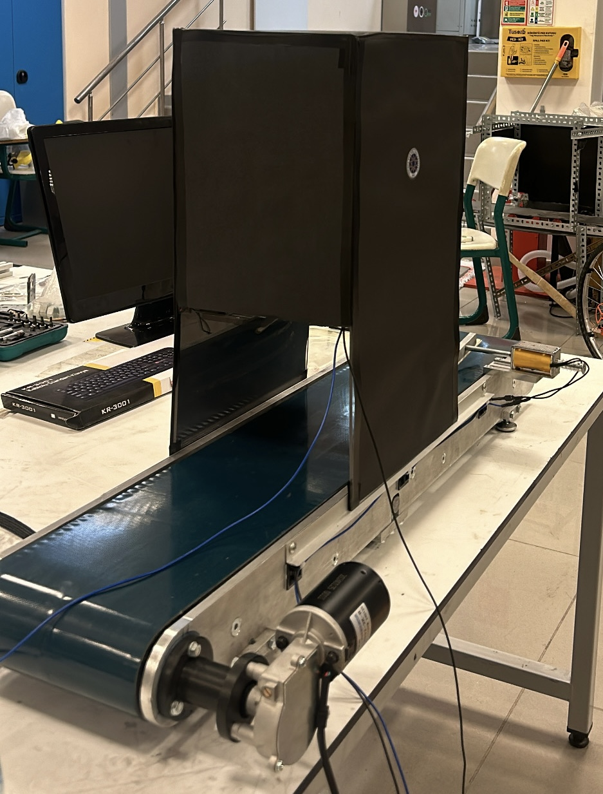
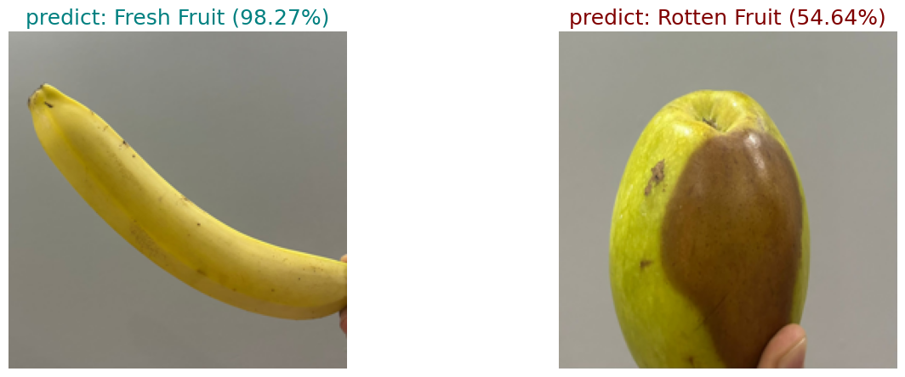

# Fruit Classification using Image Processing

## 📌 Overview
This project aims to classify fresh and rotten fruits using image processing techniques. The system utilizes computer vision algorithms to analyze fruit characteristics and determine their condition. Designed for integration with a conveyor system, it can be used for automated quality control in the food industry.

## 🎯 Features
- ✅ Image processing-based fruit classification
- ✅ Fresh vs. rotten fruit detection
- ✅ Conveyor system integration
- ✅ Real-time processing for fast decision-making

## 🛠 Technologies Used
- Python
- OpenCV
- TensorFlow/Keras (if deep learning is used)
- NumPy & Pandas
- Matplotlib (for visualization)
- Raspberry Pi (for hardware integration)


## 🖼 Conveyor System
Below is an image of the conveyor system used in this project:



## 🚀 Installation & Usage
### Clone the Repository
```bash
git clone https://github.com/faiggafarov/fruit_classification.git
cd fruit_classification
```

## 📊 Dataset
The project requires a dataset of fresh and rotten fruits. You can either use an existing dataset or collect images for training the model.

### 🔍 Running Predictions
To make predictions using the trained model, run the **fruit_detections.ipynb** notebook. This will load the model and classify the input fruit images.

## 📊 Prediction Results
Below is an example of the fruit classification output:



## 📌 Future Improvements
- Enhance model accuracy with deep learning techniques
- Improve real-time detection speed
- Extend classification to multiple fruit types

## 🤝 Contributing
Pull requests and suggestions are welcome! Feel free to improve the code or add new features.

---
### 📩 Contact
For any questions or collaboration, contact **Faig Gafarov** at [GitHub Profile](https://github.com/faiggafarov).

